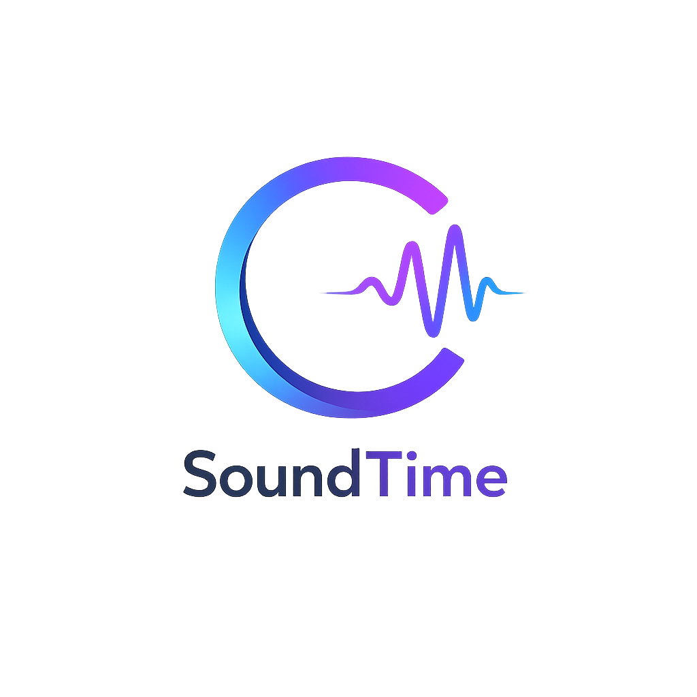

<p align="center">
  
</p>

<h1 align="center">SoundTime</h1>

<p align="center">
  <strong>Self-hosted music streaming with peer-to-peer sharing</strong>
</p>

<p align="center">
  <a href="https://github.com/CICCADA-CORP/SoundTime/actions/workflows/ci.yml"></a>
  <a href="LICENSE"></a>
  
  
  
</p>

<p align="center">
  <a href="https://discord.gg/UVCZCNcJvM">
    
  </a>
</p>

<p align="center">
  <a href="#features">Features</a> •
  <a href="#screenshots">Screenshots</a> •
  <a href="#quick-start">Quick Start</a> •
  <a href="#architecture">Architecture</a> •
  <a href="#faq">FAQ</a> •
  <a href="docs/api-reference.md">API Reference</a> •
  <a href="CONTRIBUTING.md">Contributing</a>
</p>


---

SoundTime is a self-hosted music streaming platform built with **Rust** and **SvelteKit**. Upload your music library, organize it into playlists, and share tracks across instances using **peer-to-peer networking** powered by [iroh](https://iroh.computer/) (by [n0.computer](https://n0.computer/)).

Unlike centralized platforms, SoundTime gives you full control over your music. Run it on your own server, connect with other SoundTime instances through encrypted P2P channels, and enjoy a modern, responsive listening experience.

## Features

### 🎵 Music Streaming
- **Upload & organize** — Drag-and-drop upload with automatic metadata extraction (artist, album, track number, cover art)
- **Adaptive streaming** — OPUS transcoding at 320/128/64 kbps with server-side caching
- **Autoplay** — Continuous playback that automatically queues similar tracks when the queue empties, with toggle in mini and expanded player
- **Waveform visualization** — Real-time audio waveform display powered by Symphonia
- **Lyrics support** — Fetch and display lyrics from multiple providers (Musixmatch, Lyrics.com)
- **Full-text search** — Search across tracks, albums, and artists instantly

### 📚 Library Management
- **Albums & artists** — Auto-organized from metadata with cover art support
- **Playlists** — Create, edit, and share public or private playlists
- **Personal libraries** — Curate your own collection from available tracks
- **Favorites & history** — Track your listening habits and bookmark songs
- **Batch upload** — Upload entire albums or folders at once

### 🌐 Peer-to-Peer Network
- **iroh-powered P2P** — Encrypted QUIC connections via [iroh](https://iroh.computer/) 0.96 for peer discovery and track sharing
- **DHT discovery** — Mainline DHT peer discovery via [Pkarr](https://pkarr.org/) for fully decentralized node resolution (enabled by default)
- **Relay support** — NAT traversal through [n0.computer](https://n0.computer/) production relay servers
- **Content-addressed storage** — Tracks identified by BLAKE3 hashes via iroh-blobs
- **Distributed search** — Bloom filter-based routing sends queries only to relevant peers
- **Track health monitoring** — Auto-retry on failure, 3-strike dereference with automatic re-referencing when peers return online
- **Duplicate resolution** — Best-copy selection based on format quality, bitrate, sample rate, and peer availability
- **Incremental catalog sync** — Delta-based sync avoids re-sending already-known tracks
- **Network visualization** — Interactive D3.js force-directed graph of your P2P network topology
- **Peer management** — Add, ping, and manage connected peers from the admin panel
- **Public instance listing** — Optional registration on the SoundTime directory for discoverability

### 🛡️ Security & Privacy
- **Argon2id** password hashing (OWASP-recommended)
- **JWT authentication** — Short-lived access tokens (15 min) + refresh tokens (7 days)
- **Rate limiting** — Per-IP throttling on auth endpoints via tower-governor
- **Security headers** — HSTS, X-Content-Type-Options, X-Frame-Options
- **CORS controls** — Configurable allowed origins

### 🤖 AI-Powered Features
- **Editorial playlists** — AI-generated curated playlists based on your library (OpenAI-compatible APIs)
- **Smart metadata enrichment** — Automatic metadata lookup via MusicBrainz

### 🌍 Internationalization
- 5 languages out of the box: **English**, **Français**, **Español**, **中文**, **Русский**
- Auto-detection from browser language
- Easy to add new translations

### 🔧 Administration
- **Dashboard** — Track counts, user stats, storage status at a glance
- **User management** — Roles (admin/user), banning, moderation
- **Content moderation** — Report system with review workflow
- **Storage management** — Integrity checks, S3 sync, filesystem monitoring
- **Instance settings** — Configurable from the admin panel
- **Terms of Service** — Customizable ToS with editor

## Screenshots

<p align="center">
  <em>Screenshots coming soon — see <a href="#quick-start">Quick Start</a> to try it yourself!</em>
</p>

## Tech Stack

| Layer | Technology |
|-------|-----------|
| **Backend** | Rust, [Axum](https://github.com/tokio-rs/axum) 0.8, [Sea-ORM](https://www.sea-ql.org/SeaORM/) 1.1, PostgreSQL 16 |
| **Frontend** | [SvelteKit](https://kit.svelte.dev/) 2, Svelte 5, Tailwind CSS, shadcn-svelte |
| **Auth** | Argon2id, JWT (jsonwebtoken), tower-governor |
| **Audio** | [Lofty](https://github.com/Serial-ATA/lofty-rs) (metadata), [Symphonia](https://github.com/pdeljanov/Symphonia) (decode/waveform) |
| **P2P** | [iroh](https://iroh.computer/) 0.96 (QUIC), iroh-blobs 0.96 (content-addressed storage) |
| **Visualization** | [D3.js](https://d3js.org/) 7 (network graph) |
| **Storage** | Local filesystem or AWS S3-compatible |
| **Deployment** | Docker Compose, Nginx reverse proxy |

## Quick Start

### One-Click Install (recommended)

The fastest way to get SoundTime running on any machine (Linux, macOS, Windows WSL):

```bash
curl -fsSL https://raw.githubusercontent.com/CICCADA-CORP/SoundTime/main/install.sh | bash
```

or with `wget`:

```bash
wget -qO- https://raw.githubusercontent.com/CICCADA-CORP/SoundTime/main/install.sh | bash
```

This will automatically:
- ✅ Check prerequisites (Docker, Docker Compose, git)
- ✅ Clone the repository to `~/soundtime`
- ✅ Generate a secure `.env` with random secrets
- ✅ Pull multi-arch Docker images (works on x86_64 and Apple Silicon / ARM64)
- ✅ Start all services

> **Custom install path?** Set `SOUNDTIME_INSTALL_DIR` before running:
> ```bash
> SOUNDTIME_INSTALL_DIR=/opt/soundtime curl -fsSL https://raw.githubusercontent.com/CICCADA-CORP/SoundTime/main/install.sh | bash
> ```

### Docker Compose (manual)

If you prefer to set things up manually:

```bash
git clone https://github.com/CICCADA-CORP/SoundTime.git
cd SoundTime

# Configure environment
cp .env.example .env
# Edit .env — at minimum, change JWT_SECRET to a random string

# Launch all services
docker compose up
```

Once started:
- 🎵 **Frontend**: http://localhost:3000
- 🔌 **API**: http://localhost:8080
- 🌐 **Nginx proxy**: http://localhost:8880

The first user to register automatically becomes the **admin**. Open the frontend and create your account to begin the setup wizard.

### Local Development

See the [Development Guide](docs/development.md) for a complete setup walkthrough.

**Prerequisites**: Rust 1.93+, Node.js 20+, PostgreSQL 16

```bash
# Start PostgreSQL
docker compose up postgres -d

# Configure environment
cp .env.example .env

# Backend (terminal 1)
cd backend
cargo run

# Frontend (terminal 2)
cd frontend
npm install
npm run dev
```

### Production Deployment

See the [Deployment Guide](docs/deployment.md) for production setup with SSL, custom domain, S3 storage, and P2P configuration.

## Architecture

SoundTime follows a modular monorepo architecture with a Rust backend organized into 6 specialized crates:

```
soundtime/
├── backend/
│   └── crates/
│       ├── soundtime-server     # Axum HTTP server, routes, auth, middleware
│       ├── soundtime-db         # Sea-ORM entities & database connection pool
│       ├── soundtime-migration  # 22 database migrations (PostgreSQL)
│       ├── soundtime-audio      # Audio metadata, storage, waveform generation
│       ├── soundtime-p2p        # P2P networking via iroh (discovery, health, search)
│       └── soundtime-plugin     # Plugin system (WASM/extism-based extensions)
├── frontend/
│   └── src/
│       ├── lib/
│       │   ├── components/      # 11 UI components (AudioPlayer, NetworkGraph…)
│       │   ├── stores/          # Svelte 5 rune stores (auth, player, queue)
│       │   └── i18n/            # 5 language packs
│       └── routes/              # 16 SvelteKit pages
├── docker/                      # Dockerfiles + Nginx config
├── docs/                        # Documentation
└── docker-compose.yml           # Full-stack orchestration
```

```
┌─────────────┐     ┌──────────────────────────────────────────────┐
│   Browser    │────▶│              Nginx (reverse proxy)           │
└─────────────┘     └────────┬──────────────────────┬──────────────┘
                             │                      │
                    ┌────────▼────────┐    ┌────────▼────────┐
                    │    Frontend     │    │     Backend      │
                    │   SvelteKit 2   │    │    Axum 0.8      │
                    │   Port 3000     │    │    Port 8080     │
                    └─────────────────┘    └────────┬─────────┘
                                                    │
                                    ┌───────────────┼───────────────┐
                                    │               │               │
                           ┌────────▼──┐   ┌───────▼──┐   ┌───────▼──────┐
                           │ PostgreSQL │   │  Audio   │   │   P2P Node   │
                           │   16      │   │ Storage  │   │  iroh/QUIC   │
                           └───────────┘   └──────────┘   └──────┬───────┘
                                                                 │
                                                        ┌────────▼────────┐
                                                        │ n0.computer     │
                                                        │ Relay Servers   │
                                                        └─────────────────┘
```

For a deep dive, see the [Architecture Guide](docs/architecture.md).

## Documentation

| Guide | Description |
|-------|-------------|
| [Architecture](docs/architecture.md) | System design, crate responsibilities, data flow |
| [API Reference](docs/api-reference.md) | Complete REST API documentation (60+ endpoints) |
| [Deployment](docs/deployment.md) | Production setup, SSL, S3, environment variables |
| [Development](docs/development.md) | Local dev setup, testing, project structure |
| [P2P Networking](docs/p2p-networking.md) | iroh protocol, relay servers, content addressing |

## Contributing

We welcome contributions of all kinds! Whether you're fixing a typo, adding a feature, or improving documentation — every contribution matters.

- 📖 Read the [Contributing Guide](CONTRIBUTING.md)
- 🐛 Found a bug? [Open an issue](https://github.com/CICCADA-CORP/SoundTime/issues/new?template=bug_report.md)
- 💡 Have an idea? [Request a feature](https://github.com/CICCADA-CORP/SoundTime/issues/new?template=feature_request.md)
- 🔐 Security issue? See our [Security Policy](SECURITY.md)

## Community
- 🎮 [**Join our Discord**](https://discord.gg/UVCZCNcJvM) — Chat with the developers, get support, and share feedback
- 📋 [GitHub Issues](https://github.com/CICCADA-CORP/SoundTime/issues) — Bug reports & feature requests
- 💬 [GitHub Discussions](https://github.com/CICCADA-CORP/SoundTime/discussions) — Questions & ideas

## FAQ

<details>
<summary><strong>What is SoundTime?</strong></summary>
<br>
SoundTime is a self-hosted music streaming server. You install it on your own hardware, upload your personal music library, and stream it from anywhere — on desktop, mobile, or any device with a web browser.
</details>

<details>
<summary><strong>How does the P2P network work?</strong></summary>
<br>
SoundTime uses <a href="https://iroh.computer/">iroh</a> to establish encrypted QUIC connections between instances. When enabled, your node can discover other SoundTime instances, exchange catalog metadata, and stream tracks directly peer-to-peer — without any central server. All connections go through NAT-traversal relay servers provided by <a href="https://n0.computer/">n0.computer</a>.
</details>

<details>
<summary><strong>Is my data encrypted?</strong></summary>
<br>
Yes. All P2P connections use end-to-end encryption via iroh's QUIC transport. Passwords are hashed with Argon2id (OWASP-recommended). API authentication uses short-lived JWT tokens.
</details>

<details>
<summary><strong>Can I use SoundTime without the P2P features?</strong></summary>
<br>
Absolutely. P2P is entirely optional. If you don't set the <code>P2P_ENABLED=true</code> environment variable, SoundTime works as a standalone self-hosted music server with no external connections.
</details>

<details>
<summary><strong>What audio formats are supported?</strong></summary>
<br>
SoundTime supports MP3, FLAC, WAV, OGG, AAC, AIFF and most common formats via <a href="https://github.com/pdeljanov/Symphonia">Symphonia</a> and <a href="https://github.com/Serial-ATA/lofty-rs">Lofty</a>. Uploaded tracks can be transcoded to OPUS at 320/128/64 kbps for adaptive streaming.
</details>

<details>
<summary><strong>How many users / tracks can it handle?</strong></summary>
<br>
SoundTime is designed for personal use, small or big communities. It has been tested with libraries of several thousand tracks and a handful of concurrent users. Performance depends primarily on your server's storage I/O and available memory.
</details>

<details>
<summary><strong>Can I run SoundTime on a Raspberry Pi?</strong></summary>
<br>
Yes. The Docker images are multi-arch (x86_64 and ARM64). A Raspberry Pi 4 with 4 GB of RAM is sufficient for personal use. OPUS transcoding will be slower on ARM but works fine for a single user.
</details>

<details>
<summary><strong>How do I update SoundTime?</strong></summary>
<br>

```bash
cd ~/soundtime  # or your install directory
git pull
docker compose pull
docker compose up -d
```

Database migrations run automatically on startup.
</details>

<details>
<summary><strong>Is there a mobile app?</strong></summary>
<br>
There is no dedicated mobile app — SoundTime is a progressive web application. The frontend is fully responsive and supports the <strong>Media Session API</strong>, so your phone's lock screen displays cover art, title, artist, and playback controls natively.
</details>

## Security

If you discover a security vulnerability, please report it responsibly. See [SECURITY.md](SECURITY.md) for details.

## License

SoundTime is licensed under the [GNU Affero General Public License v3.0](LICENSE).

This means you can use, modify, and distribute SoundTime freely, but if you run a modified version as a network service, you must make the source code available to its users.

---

## ⚠️ Disclaimer

SoundTime is a **self-hosted music streaming tool** designed for managing and streaming your **own personal music library**. The peer-to-peer features are intended for sharing legally owned or royalty-free content between instances you operate or trust.

**The developers of SoundTime do not endorse, encourage, or condone the use of this software for sharing, distributing, or hosting copyrighted material without proper authorization from the rights holders.**

Each SoundTime instance is independently operated. The responsibility for the content hosted, shared, or made available through a given node lies **entirely with the operator of that node** — not with the authors, contributors, or maintainers of the SoundTime software.

By using SoundTime, you acknowledge that:
- You are solely responsible for ensuring that all content on your instance complies with applicable copyright laws and regulations in your jurisdiction.
- The SoundTime project and its contributors bear **no liability** for any unlawful use of the software.
- P2P connections are made at the discretion of instance operators. Connecting to another node does not imply endorsement of its content.

If you are a rights holder and believe your content is being shared through a SoundTime instance, please contact the **operator of that specific instance** directly.

---

<p align="center">
  Made with ❤️ by <a href="https://github.com/CICCADA-CORP">CICCADA</a>
</p>
