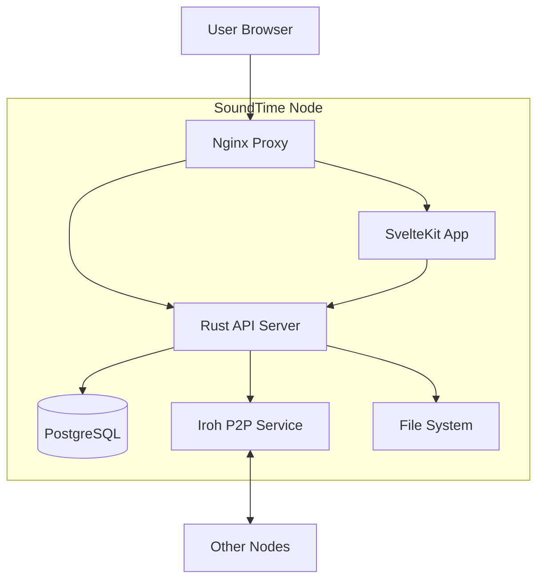

# Architecture Overview

SoundTime follows a modern, distributed architecture designed for self-sovereignty and performance.

## System Components

## Backend (`crates/soundtime-server`)

The core server is written in **Rust** for safety and speed.

- **Framework**: `axum` (0.8)
- **Database ORM**: `sea-orm` 1.1 (async, dynamic)
- **Audio Processing**: 
  - `symphonia` for decoding/transcoding
  - `lofty` for metadata parsing
- **Auth**: Argon2id + JWT (Access/Refresh token rotation)

## Frontend (`frontend`)

The user interface is a Single Page Application (SPA) powered by SvelteKit.

- **Framework**: `SvelteKit 2` + `Svelte 5` (Runes)
- **Styling**: `TailwindCSS`
- **Components**: `shadcn-svelte`
- **State Management**: Svelte 5 Runes for global stores (Player, Queue)

## Peer-to-Peer (`crates/soundtime-p2p`)

We use **Iroh 0.96** for secure, direct device-to-device communication.

- **Discovery**: DNS (PkarrPublisher) + optional mDNS + Peer Exchange (PEX)
- **Transfer**: BLAKE3 verified streaming via iroh-blobs `FsStore`
- **Identity**: Ed25519 keypairs per node (`EndpointId`)
- **Search**: Bloom filter-based distributed search across peers
- **Health**: Auto-retry, 3-strike dereference with automatic re-referencing
- **Modules**:
  - `node` — P2P node, protocol messages, catalog sync
  - `discovery` — Peer registry (in-memory)
  - `track_health` — Health monitoring, auto-repair, duplicate resolution
  - `search_index` — Bloom filter index for distributed search
  - `blocked` — Peer blocking by NodeId
  - `musicbrainz` — Metadata enrichment client
  - `error` — P2P error types

## Database Schema

We use PostgreSQL 16. Key tables include:

- `user`: Account credentials and profile.
- `track`: Audio file metadata (title, artist, duration).
- `album`: Collection grouping.
- `playlist`: User-curated lists.
- `device`: Registered P2P devices for sync.

For full schema details, see `migration/src/m20220101_000001_create_table.rs`.
